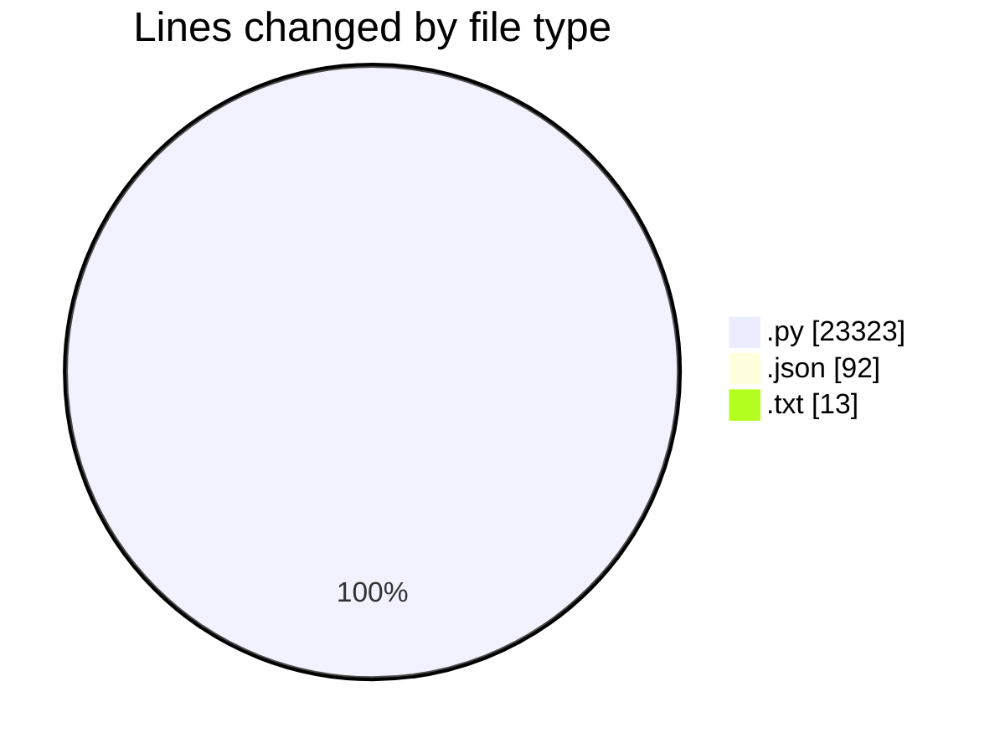
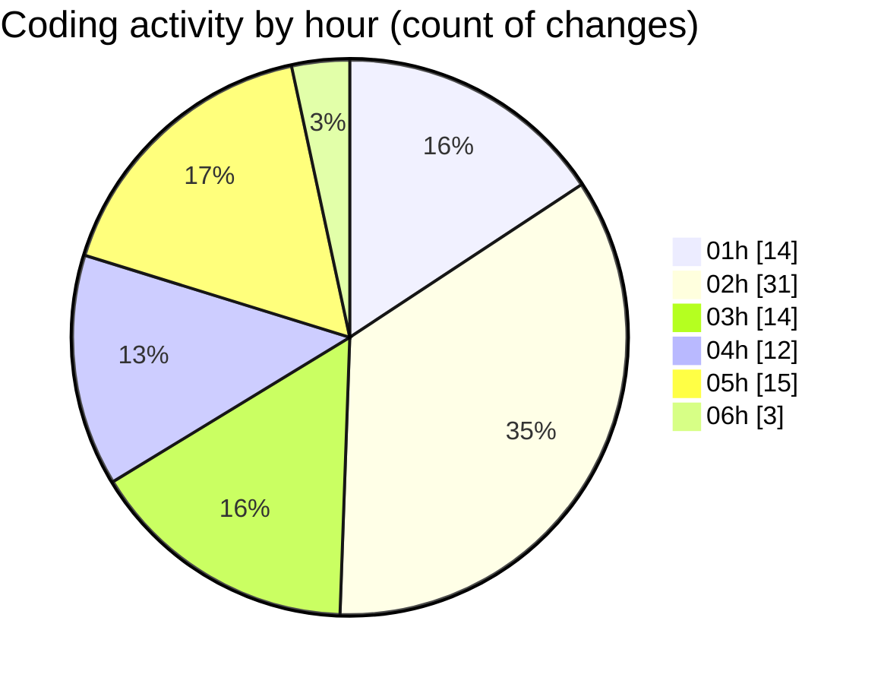

# telebot - Activity Summary 

## Overall Statistics

| Stat                   | Value                                                             |
| ---------------------- | ----------------------------------------------------------------- |
| **Lines Added** (➕)   | 22374                                          |
| **Lines Removed** (➖) | 1054                                        |
| **Net Change** (↕)    | 21320                |
| **Active Time** (⌚)   | 116 minutes |

## Modified Files
- **dashboard.py** (+278, -0)
- **ULTIMATE_SOLANA_TRADING_BOT.py** (+685, -0)
- **token_discovery.py** (+268, -0)
- **g8.py** (+249, -0)
- **PROFITABLE_SOLANA_BOT.py** (+786, -0)
- **solana_sniper_ultimate.py** (+724, -0)
- **settings.json** (+92, -0)
- **SOLANAAUTOTRADINGBOT.py** (+576, -0)
- **grok6.py** (+1528, -0)
- **grok6_profit_focused.py** (+1056, -0)
- **solana_sniper_ultra_profitable.py** (+426, -0)
- **solana_sniper_production.py** (+1014, -0)
- **trading_dashboard.py** (+591, -0)
- **performance_monitor.py** (+235, -0)
- **solana_sniper_simple.py** (+610, -0)
- **solana_sniper_aggressive.py** (+629, -0)
- **solana_sniper_ultra_aggressive.py** (+716, -0)
- **test_ultra_aggressive.py** (+42, -0)
- **solana_sniper_optimized.py** (+921, -0)
- **solana_sniper_optimal.py** (+1207, -0)
- **sniper_dashboard.py** (+82, -0)
- **grok6_enhanced.py** (+922, -0)
- **solana_sniper_live_profitable.py** (+978, -0)
- **solana_sniper_test_trade.py** (+916, -0)
- **solana_momentum_trader.py** (+942, -429)
- **config.py** (+84, -0)
- **solana_ultra_aggressive.py** (+975, -493)
- **2s.py** (+411, -0)
- **solana_guaranteed_profitable.py** (+534, -0)
- **monitor_profits.py** (+84, -0)
- **check_status.py** (+128, -51)
- **ultimate_solana_trading_bot_v2.py** (+926, -0)
- **requirements_ultimate.txt** (+13, -0)
- **start_ultimate_bot.py** (+52, -0)
- **monitor_ultimate_bot.py** (+130, -0)
- **working_solana_bot.py** (+521, -0)
- **Untitled-2.py** (+801, -0)
- **aggressive_profit_bot.py** (+705, -81)
- **fixed_jupiter_lite_bot.py** (+537, -0)

## Visualizations

### By File Type (Lines Changed)

### By Hour (Estimated Activity Count)

> **Last Updated:** 7/13/2025, 6:02:57 AM