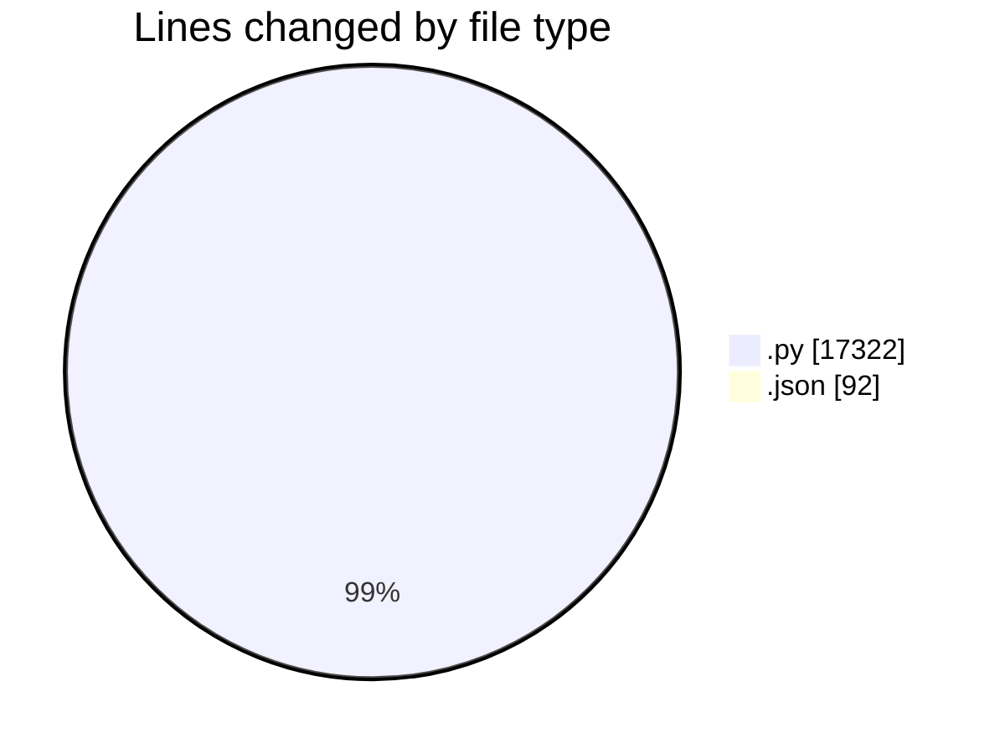
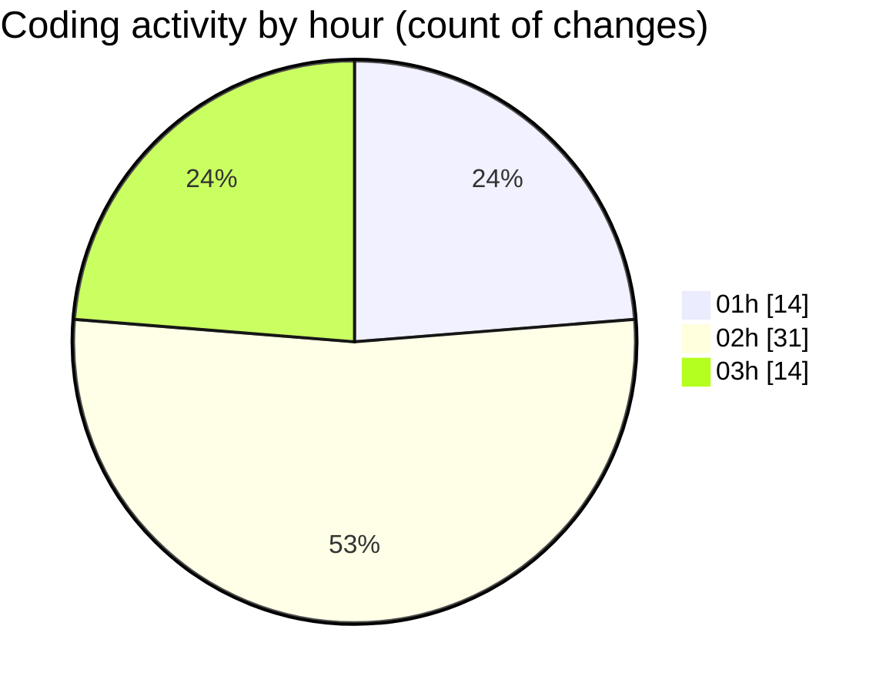

# telebot - Activity Summary 

## Overall Statistics

| Stat                   | Value                                                             |
| ---------------------- | ----------------------------------------------------------------- |
| **Lines Added** (➕)   | 17409                                          |
| **Lines Removed** (➖) | 5                                        |
| **Net Change** (↕)    | 17404                |
| **Active Time** (⌚)   | 85 minutes |

## Modified Files
- **dashboard.py** (+278, -0)
- **ULTIMATE_SOLANA_TRADING_BOT.py** (+685, -0)
- **token_discovery.py** (+268, -0)
- **g8.py** (+249, -0)
- **PROFITABLE_SOLANA_BOT.py** (+783, -0)
- **solana_sniper_ultimate.py** (+724, -0)
- **settings.json** (+92, -0)
- **SOLANAAUTOTRADINGBOT.py** (+576, -0)
- **grok6.py** (+1528, -0)
- **grok6_profit_focused.py** (+1051, -0)
- **solana_sniper_ultra_profitable.py** (+426, -0)
- **solana_sniper_production.py** (+1014, -0)
- **trading_dashboard.py** (+530, -0)
- **performance_monitor.py** (+235, -0)
- **solana_sniper_simple.py** (+610, -0)
- **solana_sniper_aggressive.py** (+629, -0)
- **solana_sniper_ultra_aggressive.py** (+716, -0)
- **test_ultra_aggressive.py** (+42, -0)
- **solana_sniper_optimized.py** (+921, -0)
- **solana_sniper_optimal.py** (+1207, -0)
- **sniper_dashboard.py** (+82, -0)
- **grok6_enhanced.py** (+922, -0)
- **solana_sniper_live_profitable.py** (+978, -0)
- **solana_sniper_test_trade.py** (+916, -0)
- **solana_momentum_trader.py** (+941, -2)
- **config.py** (+84, -0)
- **solana_ultra_aggressive.py** (+922, -3)

## Visualizations

### By File Type (Lines Changed)

### By Hour (Estimated Activity Count)

> **Last Updated:** 7/13/2025, 3:52:54 AM