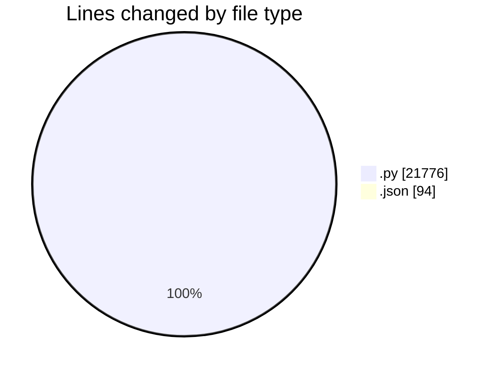
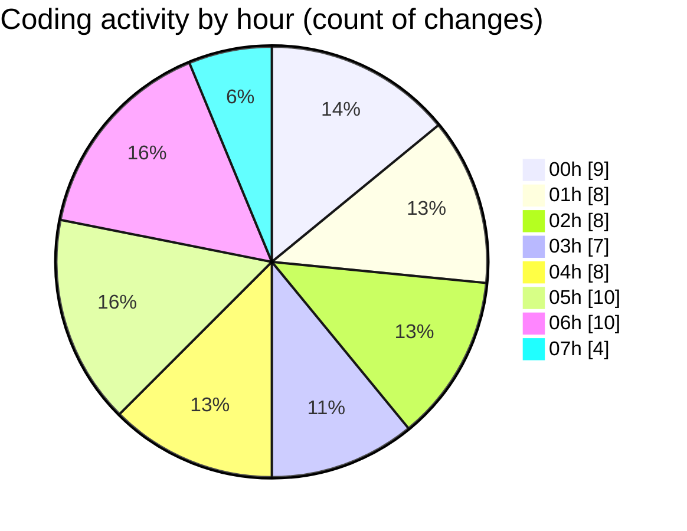

# telebot - Activity Summary 

## Overall Statistics

| Stat                   | Value                                                             |
| ---------------------- | ----------------------------------------------------------------- |
| **Lines Added** (➕)   | 20957                                          |
| **Lines Removed** (➖) | 913                                        |
| **Net Change** (↕)    | 20044                |
| **Active Time** (⌚)   | 64 minutes |

## Modified Files
- **solana_sniper_production.py** (+60, -0)
- **super_aggressive_bot.py** (+881, -0)
- **ultra_simple_bot.py** (+582, -0)
- **smart_profitable_bot.py** (+935, -0)
- **real_sniper_bot.py** (+974, -0)
- **revolutionary_bot.py** (+788, -0)
- **fixed_token_scoring_bot.py** (+883, -0)
- **working_profitable_bot.py** (+889, -0)
- **dual_wallet_adaptive_sniper.py** (+388, -0)
- **solana_pumpfun_sniper.py** (+884, -0)
- **profitable_token_discovery_bot.py** (+983, -0)
- **working_profitable_bot_v2.py** (+913, -0)
- **robust_token_fetcher.py** (+446, -0)
- **PROFITABLE_SOLANA_BOT.py** (+786, -0)
- **test_apis.py** (+245, -0)
- **FINAL_PROFITABLE_BOT.py** (+811, -0)
- **PRODUCTION_WORKING_BOT.py** (+788, -0)
- **FINAL_WORKING_BOT.py** (+1799, -899)
- **settings.json** (+94, -0)
- **FINAL_WORKING_BOT_V2.py** (+928, -0)
- **ULTRA_RELAXED_PROFIT_BOT.py** (+886, -1)
- **dashboard.py** (+351, -0)
- **REFINED_PROFIT_BOT.py** (+918, -0)
- **aggressive_profit_bot.py** (+624, -0)
- **FINAL_WORKING_PROFIT_BOT.py** (+856, -0)
- **ULTRA_PROFIT_BOT.py** (+838, -0)
- **DUAL_WALLET_ADAPTIVE_BOT.py** (+1427, -13)

## Visualizations

### By File Type (Lines Changed)

### By Hour (Estimated Activity Count)

> **Last Updated:** 7/14/2025, 7:07:11 AM