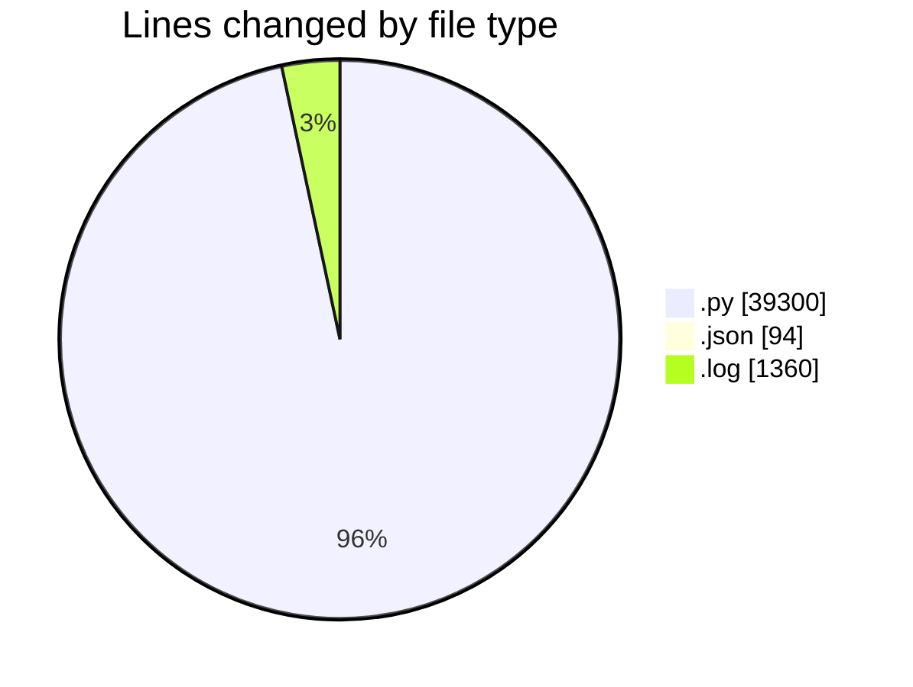
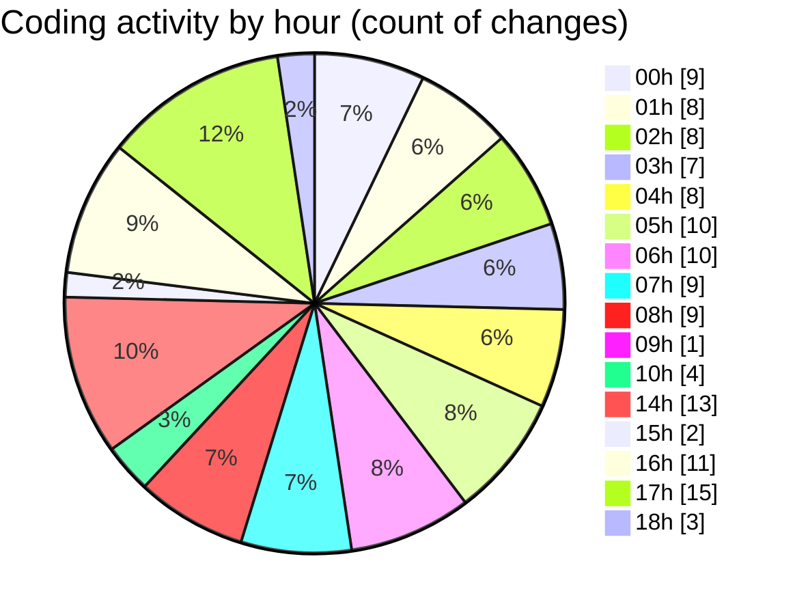

# telebot - Activity Summary 

## Overall Statistics

| Stat                   | Value                                                             |
| ---------------------- | ----------------------------------------------------------------- |
| **Lines Added** (➕)   | 37461                                          |
| **Lines Removed** (➖) | 3293                                        |
| **Net Change** (↕)    | 34168                |
| **Active Time** (⌚)   | 124 minutes |

## Modified Files
- **solana_sniper_production.py** (+60, -0)
- **super_aggressive_bot.py** (+881, -0)
- **ultra_simple_bot.py** (+582, -0)
- **smart_profitable_bot.py** (+935, -0)
- **real_sniper_bot.py** (+974, -0)
- **revolutionary_bot.py** (+788, -0)
- **fixed_token_scoring_bot.py** (+883, -0)
- **working_profitable_bot.py** (+889, -0)
- **dual_wallet_adaptive_sniper.py** (+388, -0)
- **solana_pumpfun_sniper.py** (+884, -0)
- **profitable_token_discovery_bot.py** (+983, -0)
- **working_profitable_bot_v2.py** (+913, -0)
- **robust_token_fetcher.py** (+446, -0)
- **PROFITABLE_SOLANA_BOT.py** (+1572, -243)
- **test_apis.py** (+245, -0)
- **FINAL_PROFITABLE_BOT.py** (+811, -0)
- **PRODUCTION_WORKING_BOT.py** (+788, -0)
- **FINAL_WORKING_BOT.py** (+2705, -899)
- **settings.json** (+94, -0)
- **FINAL_WORKING_BOT_V2.py** (+928, -0)
- **ULTRA_RELAXED_PROFIT_BOT.py** (+886, -1)
- **dashboard.py** (+351, -0)
- **REFINED_PROFIT_BOT.py** (+918, -0)
- **aggressive_profit_bot.py** (+1522, -0)
- **FINAL_WORKING_PROFIT_BOT.py** (+856, -0)
- **ULTRA_PROFIT_BOT.py** (+838, -0)
- **DUAL_WALLET_ADAPTIVE_BOT.py** (+1449, -518)
- **LIQUIDITY_FOCUSED_BOT.py** (+632, -0)
- **FIXED_API_ENDPOINTS_BOT.py** (+964, -65)
- **WORKING_JUPITER_BOT_FIXED.py** (+882, -0)
- **ULTIMATE_WORKING_PROFITABLE_BOT.py** (+1039, -229)
- **FIXED_NO_UNICODE_BOT.py** (+613, -0)
- **ULTRA_AGGRESSIVE_BOT.py** (+515, -0)
- **PROFITABLE_SEASONED_BOT.py** (+2050, -1011)
- **solana_sniper_ultimate.py** (+725, -0)
- **token_discovery.py** (+269, -0)
- **profit_dashboard.py** (+169, -0)
- **grok55-1.py** (+605, -0)
- **profitable_seasoned_bot.log** (+1360, -0)
- **WORKING_SEASONED_BOT.py** (+642, -0)
- **WORKING_PROFITABLE_BOT_FIXED.py** (+860, -0)
- **test_jupiter_api_fixed.py** (+201, -0)
- **PROFITABLE_WORKING_BOT_FINAL.py** (+1017, -327)
- **test_profitable_bot.py** (+114, -0)
- **PROFITABLE_WORKING_BOT_SIMPLE.py** (+830, -0)
- **api_endpoint_test.py** (+405, -0)

## Visualizations

### By File Type (Lines Changed)

### By Hour (Estimated Activity Count)

> **Last Updated:** 7/14/2025, 6:08:29 PM