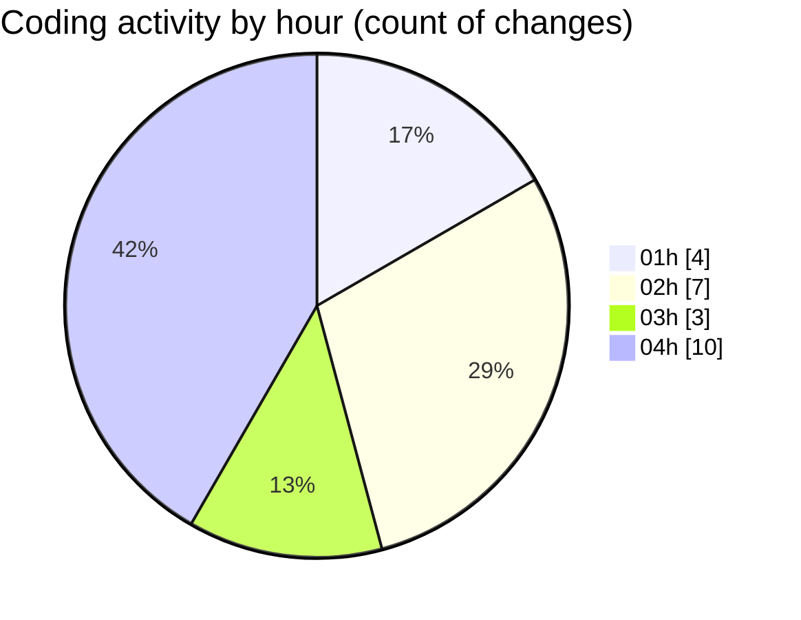

# telebot - Activity Summary 

## Overall Statistics

| Stat                   | Value                                                             |
| ---------------------- | ----------------------------------------------------------------- |
| **Lines Added** (➕)   | 3676                                          |
| **Lines Removed** (➖) | 816                                        |
| **Net Change** (↕)    | 2860                |
| **Active Time** (⌚)   | 25 minutes |

## Modified Files
- **PROFITABLE_WORKING_BOT_FINAL.py** (+97, -0)
- **FINAL_PROFITABLE_BOT.py** (+821, -0)
- **PROFITABLE_WORKING_BOT_FINAL_V2.py** (+818, -0)
- **WORKING_PROFITABLE_BOT_FIXED.py** (+9, -0)
- **PROFITABLE_SOLANA_BOT_FINAL.py** (+1734, -816)
- **TRULY_WORKING_PROFITABLE_BOT.py** (+174, -0)
- **dont.mdc** (+6, -0)
- **PROFITABLE_SEASONED_BOT.py** (+17, -0)

## Visualizations

### By File Type (Lines Changed)

### By Hour (Estimated Activity Count)

> **Last Updated:** 7/15/2025, 4:43:32 AM