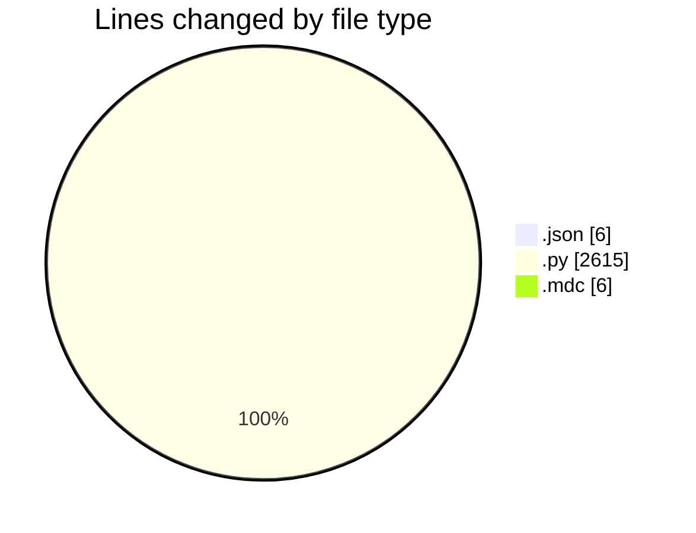
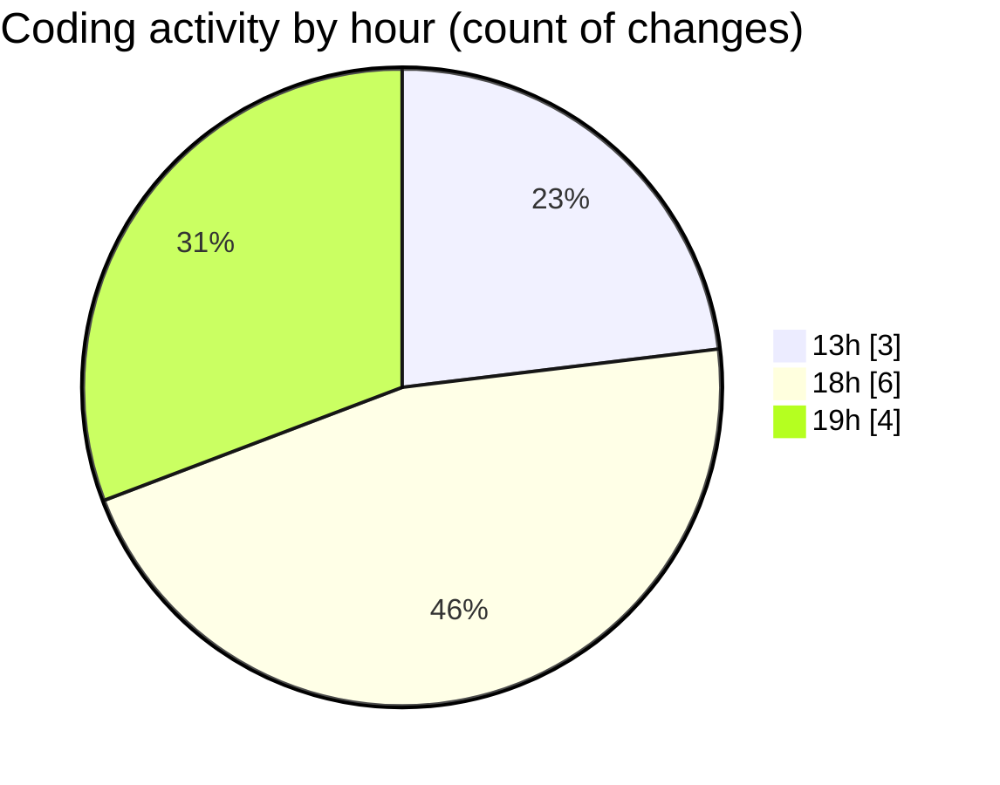

# telebot - Activity Summary 

## Overall Statistics

| Stat                   | Value                                                             |
| ---------------------- | ----------------------------------------------------------------- |
| **Lines Added** (➕)   | 2535                                          |
| **Lines Removed** (➖) | 92                                        |
| **Net Change** (↕)    | 2443                |
| **Active Time** (⌚)   | 10 minutes |

## Modified Files
- **settings.json** (+6, -0)
- **PROFITABLE_SOLANA_BOT_FINAL.py** (+991, -80)
- **dont.mdc** (+6, -0)
- **PROFITABLE_SOLANA_BOT.py** (+564, -0)
- **ULTIMATE_QUICKNODE_SOLANA_BOT.py** (+968, -12)

## Visualizations

### By File Type (Lines Changed)

### By Hour (Estimated Activity Count)

> **Last Updated:** 7/16/2025, 7:12:23 PM